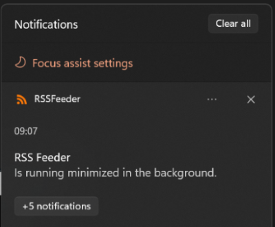
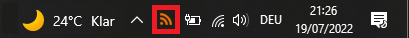
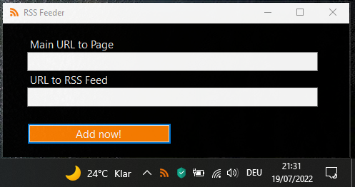

# RssFeeder
Get Windows Notifications on every change in a [RSS (Web-Feed)](https://de.wikipedia.org/wiki/RSS_(Web-Feed)) configured in this Windows Forms .NET Core 3.1 application. 

**Tested On: Windows 10 & 11**

## How To Use It
The RSSFeeder runs minimized in the background after startup and is available for interaction in the taskbar as tray icon.

### **Double Click on trac icon:** Opens configuration panel

For each source of content you want to add a *Main URL* (the URL to the actual webpage) and a URL linking directly to the RSS feed you want the application to monitor. 

### **Left Click the trac icon:** Opens a context menu

The context menu implemented provides two options: 
1. *Refresh* - Forces a pull of all sources configured
2. *Quit* - Stops the application

## TODOs
- [ ] Add Checkbox in configuration panel besides "URL to RSS Feed" textfield ("Same as above")
- [ ] Add configuration possibility for refresh times
- [ ] Add UI for deleting/managing configured sources (working tabs?)